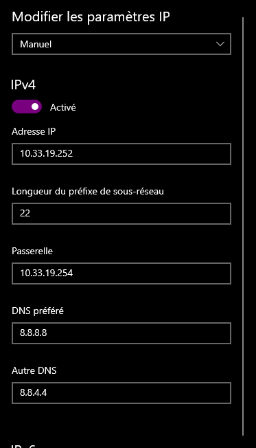

# TP1 - Mise en jambes
## I. Exploration locale en solo
### 1. Affichage d'informations sur la pile TCP/IP locale

 -  Affichez les infos des cartes réseau de votre PC
```shell
PS C:\Users\xouxo> ipconfig /all
[...]
Carte Ethernet Ethernet :

[...]
   Adresse physique . . . . . . . . . . . : 7C-10-C9-AC-92-58
[...]
Carte réseau sans fil Wi-Fi :

[...]
   Adresse physique . . . . . . . . . . . : F0-9E-4A-4D-F9-63
[...]
   Adresse IPv4. . . . . . . . . . . . . .: 10.33.19.81(préféré)
[...]
```
- Affichez votre gateway
```
PS C:\Users\xouxo> ipconfig
Carte réseau sans fil Wi-Fi :

[...]
   Passerelle par défaut. . . . . . . . . : 10.33.19.254
```
- Trouvez comment afficher les informations sur une carte IP (change selon l'OS)


- à quoi sert la gateway dans le réseau d'YNOV ?   

à communiquer hors du réseau local

### 2. Modifications des informations

- Utilisez l'interface graphique de votre OS pour changer d'adresse IP



-  Il est possible que vous perdiez l'accès internet. Que ce soit le cas ou non, expliquez pourquoi c'est possible de perdre son accès internet en faisant cette opération.

l'adresse ip est déja occupé donc on ne peut pas rejoindre le réseau

## II. Exploration locale en duo
```shell
PS C:\Users\xouxo> ping 192.168.0.1

Envoi d’une requête 'Ping'  192.168.0.1 avec 32 octets de données :
Réponse de 192.168.0.1 : octets=32 temps=2 ms TTL=128
Réponse de 192.168.0.1 : octets=32 temps=3 ms TTL=128
Réponse de 192.168.0.1 : octets=32 temps=2 ms TTL=128
Réponse de 192.168.0.1 : octets=32 temps=2 ms TTL=128

Statistiques Ping pour 192.168.0.1:
    Paquets : envoyés = 4, reçus = 4, perdus = 0 (perte 0%),
Durée approximative des boucles en millisecondes :
    Minimum = 2ms, Maximum = 3ms, Moyenne = 2ms
```
