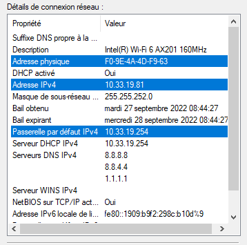

# TP1 - Mise en jambes
## I. Exploration locale en solo
### 1. Affichage d'informations sur la pile TCP/IP locale

 -  Affichez les infos des cartes réseau de votre PC
```bash
PS C:\Users\xouxo> ipconfig /all
[...]
Carte Ethernet Ethernet :

[...]
   Adresse physique . . . . . . . . . . . : 7C-10-C9-AC-92-58
[...]
Carte réseau sans fil Wi-Fi :

[...]
   Adresse physique . . . . . . . . . . . : F0-9E-4A-4D-F9-63
[...]
   Adresse IPv4. . . . . . . . . . . . . .: 10.33.19.81(préféré)
[...]
```
- Affichez votre gateway
```
PS C:\Users\xouxo> ipconfig
Carte réseau sans fil Wi-Fi :

[...]
   Passerelle par défaut. . . . . . . . . : 10.33.19.254
```
- Trouvez comment afficher les informations sur une carte IP (change selon l'OS)

